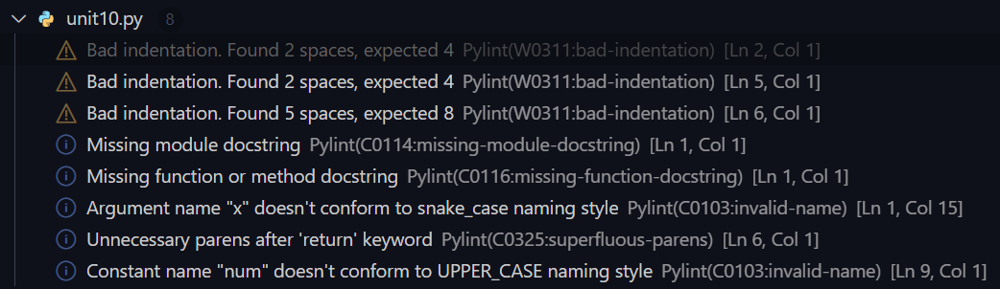

## Table of Contents
- [Seminar Preparation](#seminar-preparation)
- [Reflection](#reflection)


## Seminar Preparation

## Activity 1
- Run the following code using pylint and identify the errors.  

```py
def factorial (x)
    if x == 1:
        return 1

    else:
        return (x * factorial(x-1))

num = 3
print("The factorial of", num, "is", factorial(num)) 
```
pylint output:


---

## Activity 2
- In ‘Packaging & Testing’ (unit 9), we examined the use of documentation to support code developments. Add appropriate commenting and documentation for the code below.  

```py
def add(x, y):
  """This function adds two numbers"""
  return x + y


def subtract(x, y):
  """This function subtracts two numbers"""
  return x - y


def multiply(x, y):
  """This function multiplies two numbers"""
  return x * y


def divide(x, y):
  """This function divides two numbers"""
  return x / y

# Print the available operations
print("Select operation.")
print("1.Add")
print("2.Subtract")
print("3.Multiply")
print("4.Divide")
# While loop to make the calculator run until the user wants to stop
while True:
    choice = input("Enter choice(1/2/3/4): ")
    if choice in ('1', '2', '3', '4'):
        # Take input from the user and convert it to float
        num1 = float(input("Enter first number: "))
        num2 = float(input("Enter second number: "))
        # Check which operation the user wants to perform
        if choice == '1':
            print(num1, "+", num2, "=", add(num1, num2))
        elif choice == '2':
            print(num1, "-", num2, "=", subtract(num1, num2))
        elif choice == '3':
            print(num1, "*", num2, "=", multiply(num1, num2))
        elif choice == '4':
            print(num1, "/", num2, "=", divide(num1, num2))
    # break the while loop if answer is no
    next_calculation = input("Let's do next calculation? (yes/no): ")
    if next_calculation == "no":
        break
    # If the user enters anything other than the available options print an error message
    else:
        print("Invalid Input")
```