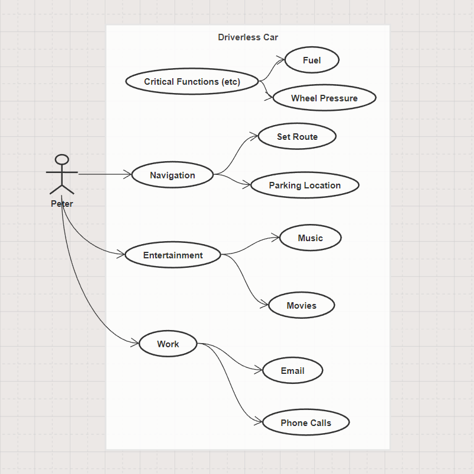

## Table of contents
- [Pen Portrait](#pen-portrait)
- [Use Case Diagram](#use-case-diagram)
- [Python Program](#python-program)


## Pen Portrait
- Write a pen portrait for a user of a driverless car

> Peter is a busy professional who lives and works in the city. he owns a driverless car, which has transformed his daily routine. In the morning, peter sets his destination on his car's navigation system and gets in. The car greets him with a friendly voice, and he can relax or catch up on work while it drives him to his destination. His driverless car remains parked throughout the day, fully charged and ready to go when he needs it. At the end of the day, peter gets back in his car and heads home, enjoying the car's entertainment system on the way. Overall, owning a driverless car has made peter's life easier, more convenient, and more enjoyable.

---
## Use Case Diagram
- Create a use case model which captures the ways in which a user needs to interact with the software system  



---
## Python Program
- Write a Python program to achieve basic employee-related functionality which includes retaining employee details and allowing an employee to book a day of annual leave. Extend the Python program you have now created to use protected and unprotected variables.

```py
# Employee details and annual leave
class Employee():

  def __init__(self, name, surname, empID, leave):
    self.name = name # unprotected variable
    self.surname = surname # unprotected variable
    self._empID = empID # protected variable
    self._leave = leave # protected variable

  def scheduleLeave(self, days):
    if days <= self._leave:
      self._leave -= days
      print("You have scheduled annual leave")
    else:
      print("You have taken too much leave")
  

# Create an instance of the Employee class
employee1 = Employee("Nkosi", "T", "1234", 20)
# Print the employee details
print(f"I am {employee1.name} {employee1.surname}, my employee ID is {employee1._empID} and I have {employee1._leave} days of annual leave left")
# Book annual leave
employee1.scheduleLeave(21)
```

---